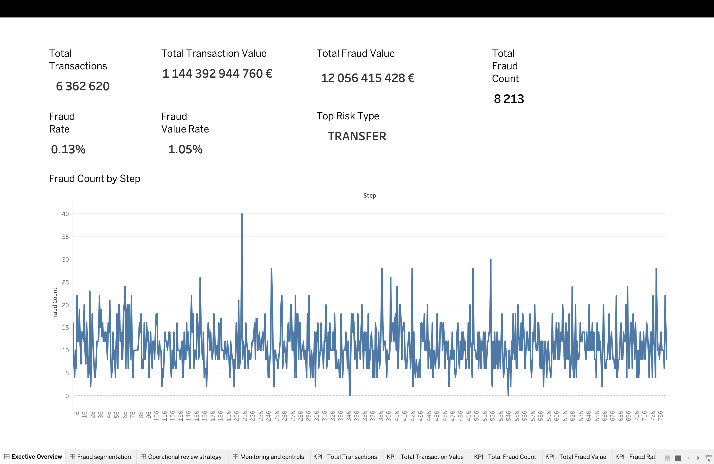
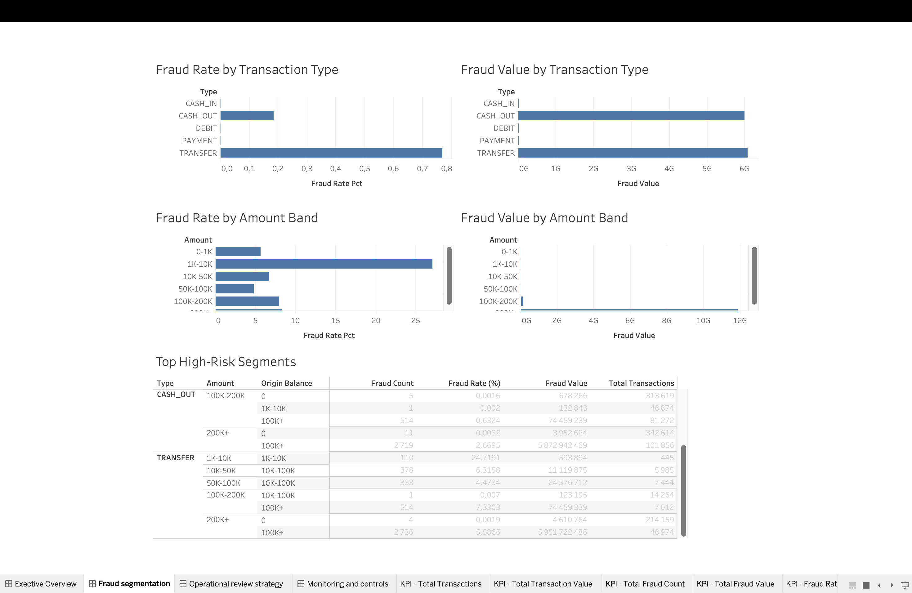
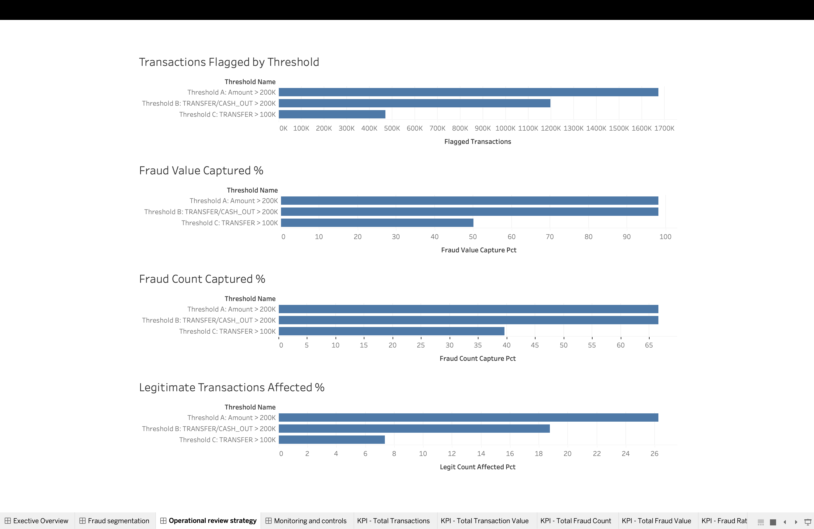

# Fintech Fraud & Transaction Risk Analysis

## Project Overview
This project analyzes transaction-level fraud risk in a fintech payments dataset. The objective is to identify where fraud is concentrated, define practical review thresholds, and propose a monitoring framework that a risk team could use to support fraud detection and manual review decisions.

The analysis is designed as a business-focused analytics project rather than a machine learning project. The emphasis is on fraud concentration, operational trade-offs, and practical recommendations for monitoring and review.

## Project Highlights
- Fraud occurs only in TRANSFER and CASH_OUT transactions
- Transactions above 200K drive most fraud value
- Recommended review rule: TRANSFER and CASH_OUT above 200K
- Targeted threshold captures 98.15% of fraud value with lower review burden than a broader rule

## Dashboard Preview

### 1. Executive Overview
Shows high-level fraud KPIs, fraud rates, and fraud trend over transaction steps.

### 2. Fraud Segmentation
Shows where fraud is concentrated across transaction type, amount band, and high-risk segment combinations.

### 3. Operational Review Strategy
Compares candidate review thresholds and supports the recommended manual-review rule.

## Business Problem
Fraud teams cannot manually review every transaction. To manage fraud effectively, a business needs to understand:
- which transaction segments carry the highest risk
- how fraud is distributed across transaction types and transaction sizes
- which review thresholds capture the most fraud with the lowest impact on legitimate activity
- which metrics should be monitored each week

## Objective
The project aims to:
- assess data quality
- measure core fraud KPIs
- identify high-risk transaction segments
- test candidate manual-review thresholds
- define a weekly monitoring framework
- translate findings into practical business recommendations

## Dataset
The analysis uses the PaySim synthetic financial transactions dataset, which simulates mobile money transactions and fraud behavior. Key variables include transaction type, transaction amount, origin and destination balances, fraud labels, and flagged fraud indicators.

Because the dataset is synthetic, the analysis is best interpreted as a realistic analytical exercise rather than a direct representation of a live financial system.

## Tools Used
- DuckDB for SQL analysis
- Tableau Desktop for dashboard design
- GitHub for project documentation and portfolio presentation

## Project Workflow

### Phase 1–2: Setup and exploration
Initial project planning, dataset understanding, and transaction field review.

### Phase 3: Data quality review
The dataset was checked for:
- missing values
- duplicates
- invalid transaction amounts
- balance consistency issues
- fraud distribution
- unusual values

### Phase 4: Core KPI analysis
The analysis measured:
- total transactions
- total transaction value
- fraud count
- fraud value
- fraud rate
- fraud rate by transaction type

### Phase 5: Risk segmentation
Fraud was segmented by:
- transaction type
- amount band
- origin balance band
- combinations of type, amount, and balance conditions

### Phase 6: Threshold analysis
Candidate review thresholds were tested to estimate:
- fraud captured
- fraud value captured
- legitimate transactions affected
- operational practicality

### Phase 7: Monitoring framework
A weekly monitoring structure was proposed, including:
- exposure metrics
- fraud metrics
- threshold-performance metrics
- alert conditions
- dashboard usage guidance

## Key Findings

### 1. Fraud is concentrated in two transaction types
Fraud appears only in TRANSFER and CASH_OUT transactions in this dataset. TRANSFER shows the highest fraud rate, while CASH_OUT is the second highest-risk type.

### 2. High-value transactions drive most fraud exposure
Transactions above 200K account for the largest share of fraud value and a large share of total fraud cases.

### 3. Higher-balance origin accounts show elevated fraud risk
Transactions from origin accounts with balances above 100K have the highest fraud rate among balance groups.

### 4. Fraud is best explained through combinations of risk factors
The highest-risk segments are combinations of transaction type, amount band, and origin balance band, especially high-value TRANSFER and CASH_OUT activity.

### 5. A targeted threshold outperforms a broad amount-only rule
Reviewing TRANSFER and CASH_OUT transactions above 200K captures 66.61% of fraud cases and 98.15% of fraud value while affecting a smaller share of legitimate transactions than a broader amount-only threshold.

## Recommended Review Strategy
The recommended manual-review rule is:

**Review TRANSFER and CASH_OUT transactions above 200K**

This threshold is preferred because it:
- captures the same fraud as a broader amount-only threshold
- reduces unnecessary legitimate review volume
- aligns with the concentration of fraud observed in the segmentation analysis

A secondary watchlist can be used for TRANSFER transactions above 100K as a narrower risk-monitoring layer.

## Monitoring Framework
A risk team should monitor the following weekly:
- total transactions
- total transaction value
- fraud count
- fraud value
- fraud rate
- fraud rate by transaction type
- number and value of transactions above the review threshold
- review queue volume
- fraud captured by threshold
- legitimate activity affected by threshold

Suggested alerts include:
- fraud rate spikes above recent baseline
- increases in TRANSFER or CASH_OUT fraud
- surges in high-value flagged transactions
- review volume above operational capacity

## Caveats
- The dataset is synthetic, so real-world fraud behavior may differ.
- Results depend on the available variables and do not include customer-level or behavioral history.
- Threshold effectiveness may change over time if fraud patterns shift.
- Operational review capacity was not modeled directly beyond volume estimates.

## Next Steps
Potential future improvements include:
- adding time-based weekly or hourly trend analysis
- analyzing customer/account-level repeat behavior
- testing additional risk indicators
- evaluating anomaly detection or predictive scoring models
- refining review thresholds based on operational capacity

## Repository Contents
- SQL scripts for data quality, KPI analysis, risk segmentation, and threshold analysis
- text files for business findings and monitoring recommendations
- Tableau dashboards for KPI, risk segmentation, and threshold review pages
- final business-facing write-ups

## Final Conclusion
This project shows that fraud risk in the dataset is highly concentrated in specific transaction types and high-value segments. A focused threshold strategy combined with weekly monitoring provides a practical and explainable fraud-control framework. The analysis demonstrates how transaction data can be translated into business decisions, review rules, and monitoring recommendations.
